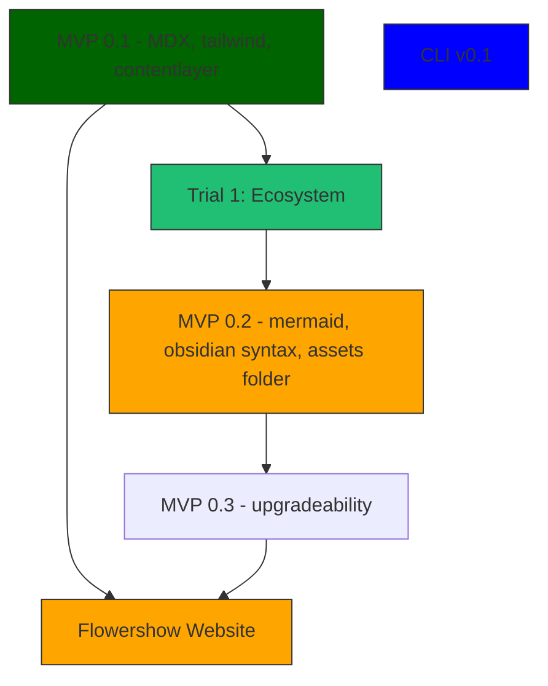
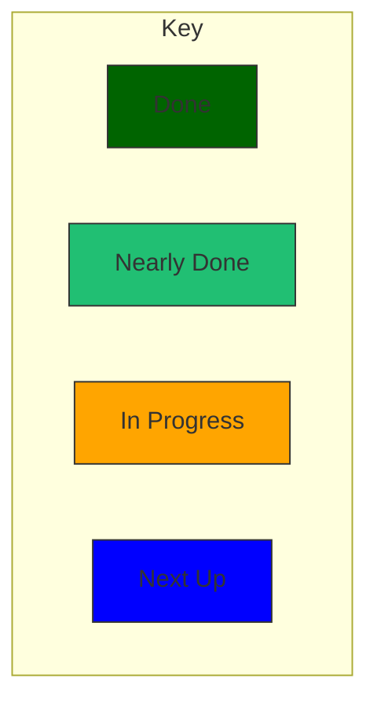

# Designs and Plans for Flowershow

Turn your digital garden / second brain / obsidian vault into a beautiful (and customizable) website in seconds.

Taglines:

- Author in Obsidian, Publish in Flowershow
- Present your ideas, beautifully
- Share your digital garden.

# Plan

As of 2022-07-06

Key Question 2022-07-11: to what extent do we care about MDX and theming support (power wiki) vs more KISS and focus on obsidian?

* [ ] Landing page for the product **40% 📝https://github.com/flowershow/flowershow/issues/4 ⏭️ finish copy, work out how theme**
* [ ] Trial product e.g. on flowershow itself or building Life Itself new community site. Possible candidates **[#21](https://github.com/flowershow/flowershow/issues/21)**
  * [ ] flowershow site itself **🚧2022-07-11 40%**
  * [x] ecosystem site  **✅2022-07-08 100% complete.**
  * [ ] Life Itself community site
* [ ] Basic working product e.g. command line tool, template etc
  * [ ] Template webapp **🚧2022-07-11 70% [#1](https://github.com/flowershow/flowershow/issues/1)**
  * [ ] Command line tool **DEFERRED on need**
* [ ] Promotion
  * [ ] (? separate) some kind of launch e.g.
  * [ ] post on obsidian forum
  * [ ] post on reddit re pkm etc
  * [ ] post on dev.to (later when more working?)

## Launch v0.1 July 2022

Target: 19 July 2022

- Elegant website with signup
- MVP Product
  - v0.1
  - v0.2
  - v0.3






# Website

Feature List

* [ ] front page
* [ ] docs section
* [ ] blog
* [ ] social links
* [ ] Made in Flowershow gallery or similar

# Features

In very rough order of likely priority in each section

* [x] Markdown - full markdown plus footnotes
* [x] MDX support for rich component additions. Built on MDX so you can use everything Next.JS provides out of the box including full React e.g. want a custom front page? No problem!
  * [ ] Documentation / examples
- [x] Tailwind: built on tailwind so easy to adjust and customize
* [ ] SEO support
* [ ] Basic site config
* [ ] Basic theme e.g. navbar and footer
* [ ] Analytics - google - this could be first test for componentization (or maybe just live with default for now)
* [ ] theme customization
* [ ] Code highlighting - e.g. use https://github.com/timlrx/rehype-prism-plus
  * [ ] Do we use prism or highlight.js. **✅2022-06-29 Answer: prism i think (same speed, more plugins (?))**
* [ ] Maths syntax (mathjax etc)
* [ ] Mermaid
- [ ] Citation / Bibliographic references: use standard `[@jones-2020]` style bibliographic citations in markdown (compatible with Obsidian zotero, R markdown etc) - https://github.com/timlrx/rehype-citation
* [ ] Desktop and mobile: beautiful, responsive theme out of the box
* [ ] Full text search: search quickly and easily.
* [ ] social preview links e.g. twitter link turns into a nice twitter card. Ditto for youtube.
* [ ] Edit page on github/gitlab

Obsidian feature compatibility

* [ ] support Obsidian wiki-link extensions to markdown
* [ ] Callouts / admonitions - https://help.obsidian.md/How+to/Use+callouts
* [ ] Backlinks
* [ ] Forward links
* [ ] Network graph
* [ ] Excalidraw
- [ ] How do we support obsidian plugins in general

Theme

* [ ] Dark/light theme
* [ ] Wide images
* [ ] [[#Linkable headings]]
* [ ] frontmatter support e.g. of standard fields
  - author
  - date (published)
  - status: 
  - publish: true/false
* [ ] Image optimization
  * Good summary of pros and cons and how to do it https://tailwind-nextjs-starter-blog.vercel.app/blog/guide-to-using-images-in-nextjs

Data stuff

* [ ] table preview
* [ ] graphs

# Content

## Tutorials and Howtos

* [ ] Get started (self-service and deploy)
* [ ] Custom components in markdown pages

Blogs

* [ ] Why Flowershow

Advanced

* [ ] Markdown extension addition (howto do that)
* [ ] Content structuring and contentlayer (latter more for devs)


## Details
### Linkable headings

https://tailwindcss.com/docs/responsive-design

- Only shows when you hover the heading
- Nice symbol
- Shows to left of text
- Only shows on desktop


### Table of contents

Again tailwindcss.com is excellent. For example: https://tailwindcss.com/docs/customizing-colors

Two contents sections:

- LHS: full site table of contents
- RHS: table of contents for this page


Code: https://github.com/tailwindlabs/tailwindcss.com/blob/8b9f69a93a5a1b055dc8c1dcfa06f5ca2863b89c/src/layouts/ContentsLayout.js


### Obsidian markdown syntax

What's needed:

- [ ] `[[Internal link]]`
- [ ] `[[Internal link|With custom text]]`
- [ ] `[[Internal link#heading]]`
- [ ] `[[Internal link#heading|With custom text]]`

🚩 Not sure these are needed to start with

- [ ] `![[Embed note]]`
- [ ] `![[Embed note#heading]]`

#### Research

https://obsidian.md/features

GitHub Flavored Markdown (GFM) extensions

```
- | Markdown **table** |
- **- [x] Task list**
```

Extra Obsidian:

```
-   **#Tags**
-   $$**LaTeX** math$$
-   [^**Footnotes**]
-   **[[Internal links]]**
-   **![[Filename]]** to embed notes and other files
```