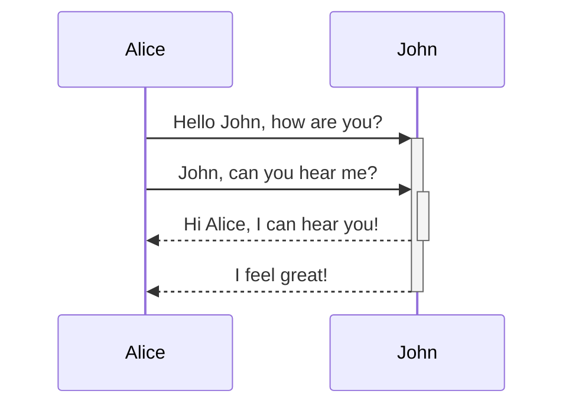

Mermaid lets you create diagrams and visualizations using a simple text-based syntax. You can read more about [Mermaid diagrams on the Mermaid website here](https://mermaid-js.github.io/mermaid/#/).

Because it is text-based mermaid is very well suited to being using in plain-text and markdown.

## How to use

To create a mermaid diagram you embed inside a special code block with the type of `mermaid` i.e.

````md
```mermaid

MERMAID DIAGRAM CODE GOES HERE

```
````

Here's an example:

````md

````

This will render as:

