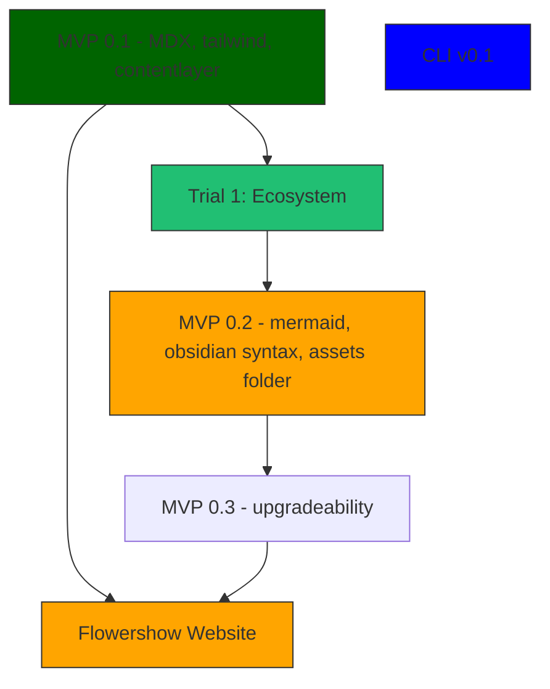
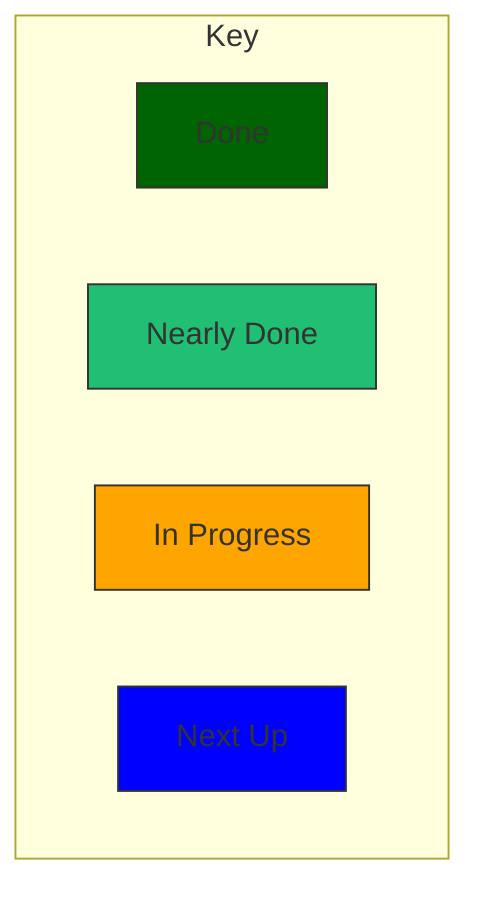

# Designs and Plans for Flowershow

Turn your digital garden / second brain / obsidian vault into a beautiful (and customizable) website in seconds.

Taglines:

- Author in Obsidian, Publish in Flowershow
- Present your ideas, beautifully
- Share your digital garden.

# Plan

Workstreams

- Template (app)
- Publishing
  - Tooling (CLI etc)
  - Cloud
- Website (flowershow.app)

Milestones

- [ ] **Milestone 1**: launch product website for flowershow at flowershow.app
  - [ ] Build it with flowershow so
  - [ ] => flowershow template v0.1 with decent set of features.
- [ ] **Milestone 2**: MVP for self-publishing i.e. can scaffold and build a flowershow-driven site locally with deployment up to user

Backlog

- [ ] **Milestone X**: cloud publishing
- [ ] **Milestone X**: data literate documents
- [ ] **Milestone X**: feature X, Y, Z
- [ ] Milestone X: publishing ecosystem using flowershow
- [ ] Milestone X: publishing web3 using flowershow
- [ ] Milestone X: 100 users of flowershow

# Reviews

## 2022-08-16

Milestone 1 is complete

Milestone 2 starts which is rolling this out again to other sites

- [ ] Promotion and engagement on obsidian forums

## 2022-07-06

Key Question 2022-07-11: to what extent do we care about MDX and theming support (power wiki) vs more KISS and focus on obsidian?

- [x] Landing page for the product **40% 📝https://github.com/flowershow/flowershow/issues/4 ⏭️ finish copy, work out how theme** **✅2022-08-16**
- [x] Trial product e.g. on flowershow itself or building Life Itself new community site **[🚧 issue #21](https://github.com/flowershow/flowershow/issues/21)** **✅2022-08-16 we trialled this in early July. Worked though saw some upgradeability stuff especially around components etc**
  - [x] flowershow site itself **🚧 2022-07-11 40%**
  - [x] ecosystem site **✅2022-07-08 100% complete.**
  - [ ] Life Itself community site **❌2022-08-16 not worked on**
- [ ] Basic working product e.g. command line tool, template etc **❌2022-08-16 deferred but basic site is working**
  - [x] Template webapp **🚧2022-07-11 70% [#1](https://github.com/flowershow/flowershow/issues/1)** **✅2022-08-16 this was working**
  - [ ] Command line tool **⏳ [issue #19](https://github.com/flowershow/flowershow/issues/19) DEFERRED on need. not urgent**
- [ ] Promotion **🚧 [issue #25](https://github.com/flowershow/flowershow/issues/25)** **🚧2022-08-16 about to be done**
  - [x] post on obsidian forum
  - [ ] post on reddit re pkm etc **❌2022-08-16 this will be deferred to proper product launch**
  - [ ] post on dev.to (later when more working?) **❌2022-08-16 deferred until working product**

## Launch v0.1 July 2022

Target: 19 July 2022

- Elegant website with signup
- MVP Product
  - v0.1
  - v0.2
  - v0.3

# Website

Feature List

- [x] front page **✅2022-08-16**
- [x] docs section
- [ ] blog **❌2022-08-16 not a priority atm**
- [ ] social links
- [ ] Made in Flowershow gallery or similar **⌛2022-08-16**

# Template Features

In very rough order of likely priority in each section

- [x] Markdown - full markdown plus footnotes **✅2022-07-06**
- [x] MDX support for rich component additions. Built on MDX so you can use everything Next.JS provides out of the box including full React e.g. want a custom front page? No problem! **✅2022-08-16 - 2022-07-06 was partly but we did not have this fully resolved or documented**
  - [x] Documentation / examples **✅2022-08-16**

* [x] Tailwind: built on tailwind so easy to adjust and customize **✅2022-07-06**

- [x] SEO support **🚧 [issue #57](https://github.com/flowershow/flowershow/issues/57)** **✅2022-08-16**
- [x] Basic site config **✅ [issue #1](https://github.com/flowershow/flowershow/issues/1) and [issue #7](https://github.com/flowershow/flowershow/issues/7)**
- [x] Basic theme e.g. navbar and footer **✅ [issue #23](https://github.com/flowershow/flowershow/issues/23)**
- [x] Analytics - google - this could be first test for componentization (or maybe just live with default for now) **✅ [issue #1](https://github.com/flowershow/flowershow/issues/1) and [issue #31](https://github.com/flowershow/flowershow/issues/31)**
- [ ] theme customization
- [x] Code highlighting - e.g. use https://github.com/timlrx/rehype-prism-plus **✅ [issue #17](https://github.com/flowershow/flowershow/issues/17)**
  - [x] Do we use prism or highlight.js. **✅2022-06-29 Answer: prism i think (same speed, more plugins (?))**
- [x] Maths syntax (mathjax etc) **🚧 [issue #64](https://github.com/flowershow/flowershow/issues/64)** **✅2022-08-16**
- [x] Mermaid **🚧 [issue #12](https://github.com/flowershow/flowershow/issues/12)** **✅2022-08-16**

* [ ] Citation / Bibliographic references: use standard `[@jones-2020]` style bibliographic citations in markdown (compatible with Obsidian zotero, R markdown etc) - https://github.com/timlrx/rehype-citation

- [x] Desktop and mobile: beautiful, responsive theme out of the box **✅2022-08-16**
- [x] Full text search: search quickly and easily. **✅2022-08-16**
- [ ] social preview links e.g. twitter link turns into a nice twitter card. Ditto for youtube.
- [ ] Edit page on github/gitlab

**Obsidian feature compatibility**

- [x] support Obsidian wiki-link extensions to markdown **working links to pages (also with custom names) but still working on links to headings, links to blocks and links to files - 🚧 [issue #47](https://github.com/flowershow/flowershow/issues/47), [issue #62](https://github.com/flowershow/flowershow/issues/62), [issue #63](https://github.com/flowershow/flowershow/issues/63)**
- [ ] Callouts / admonitions - https://help.obsidian.md/How+to/Use+callouts **🚧 [issue #60](https://github.com/flowershow/flowershow/issues/60)**
- [ ] Backlinks **🚧 [issue #29](https://github.com/flowershow/flowershow/issues/29)**
- [ ] Forward links **🚧 [issue #28](https://github.com/flowershow/flowershow/issues/28)**
- [ ] Network graph **🚧 [issue #37](https://github.com/flowershow/flowershow/issues/37)**
- [ ] Excalidraw **🚧 [issue #10](https://github.com/flowershow/flowershow/issues/10)**

* [ ] How do we support obsidian plugins in general **🚧 [issue #61](https://github.com/flowershow/flowershow/issues/61)**

## Theme\*\*

- [ ] Dark/light theme **🚧 [issue #56](https://github.com/flowershow/flowershow/issues/56)**
- [ ] Wide images **❓what do we mean by this**
- [ ] [[#Linkable headings]]
- [ ] frontmatter support e.g. of standard fields
  - author
  - date (published)
  - status:
  - publish: true/false
- [ ] Image optimization
  - Good summary of pros and cons and how to do it https://tailwind-nextjs-starter-blog.vercel.app/blog/guide-to-using-images-in-nextjs

## Data stuff

- [ ] table preview **❓what do we mean by this**
- [ ] graphs **❓what do we mean by this (network/knowledge graph?)**

# Content

## Tutorials and Howtos

- [ ] Get started (self-service and deploy)
- [ ] Custom components in markdown pages

Blogs

- [ ] Why Flowershow

Advanced

- [ ] Markdown extension addition (howto do that)
- [ ] Content structuring and contentlayer (latter more for devs)
