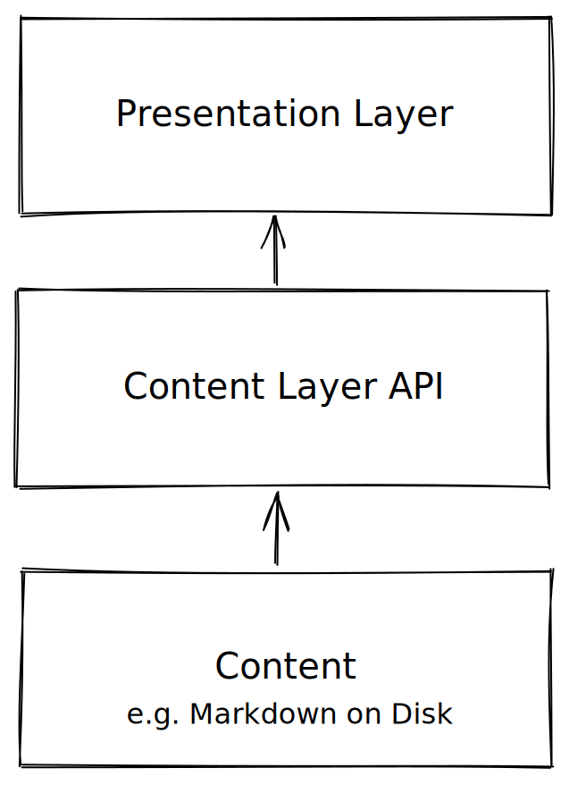

A Content Layer is an API to content, in our case markdown. It provides an intermediate layer between presentation layer and the raw content on disk.

* **Why**: in a JADStack/JAMstack app i need to get content or data e.g. blog posts in markdown. Can just load files but quickly need things like `getAllBlogPosts` => need a lib for this
* **How**: roll-your-own, contentlayer.dev, ...




Named by analogy with the [data layer](https://martinfowler.com/bliki/PresentationDomainDataLayering.html) in classic application architecture (as defined by Martin Fowler et al).

It  part of [[notes/treating-content-like-data|treating content like data]].

A Content Layer has similar connotations to "Content Lakes" a terminology e.g. Sanity.io are using.

# Introduction

A content layer API is an API to the content in the application.

Focus is on JAMStack setups where content is stored in markdown on disk. The simplest API is just `getFile`. However, you often want something more than that which allows for querying e.g. `getAllPosts`. More generally, we want a content **model** and an API against that. This is the content layer API. It provides a convenient API a level above simple `getFile`.

> It's the headless API for file-based CMS.

Called *Content* Layer because access to content. However, basically a data layer in traditional pattern language terms.

# Architecture

Three parts to a Content Layer

* **Modelling**: model the data.
  * Computed fields
  * References e.g. `BlogPost hasA Category` 
* **Import**: import content into a "DB". E.g. finding markdown files on disk, parsing them and adding them to the "DB". Adding the computed fields or other processing e.g. adding reading time, or backlinks
* **API**: DB API: a way to query DB e.g. `getAllPosts`, `getAllCollections`
  * Search and filter:
  * Getting a given "object" (i.e. markdown page) and rendering it

🚩 contentlayer.dev get themselves involved in the content presentation. Makes sense in some ways as already parsing the MDX for you. However, think this can get messy and IMO cleanest is to just give "path" to file (or better the raw content) and allow user to process it so they can do whatever markdown processing they want.


# Research

**Recommended**: https://contentlayer.dev

Also look at [Tina](#Tina)

Options:

* Tina: Nice, but tina seems to be doing too many things IMO and the key approach of static only (no server) is limited
* ContentLayer: seems the KISS-est so far and good people behind it
* Sanity: import data regularly (e.g. via https://github.com/kmelve/markdown-to-sanity) and then use Sanity API. 🔽 a real hack and painful to keep importing, not sure of markdown processing etc

## Tina

Here you get a full graphql layer.

* Content modelling: https://tina.io/docs/schema/. Use "content modelling as code" writing the content model in typescript (like contentlayer.dev does)
  * Can you do references (foreign keys): Yes
* DB API: graphql
* Simplicity: Medium
* Can i use w/o server in SSG: sort-of 🚩

### Notes

Here's a question i asked on their discord channel:

> Hi, suppose i'm doing a pure static site. Can I use  the tina graphql layer but call it from code in nextjs getStaticProps? Or do i have to run the server and then call the server ...?
>
> Put more explicitly is their a library endpoint to the graphql layer that i can use without running the server on port 4001?

The answer i found:

> To answer myself: is the examples here what I'm looking for? https://github.com/tinacms/tinacms/discussions/2249 + https://github.com/tinacms/tinacms/blob/main/packages/%40tinacms/cli/GeneratedClientDocs.md

Answer from tina devs was:

> This is a great question, and to add a bit of context the SDK does require for the GraphQL server to be running. But to answer your more broad question, you could do this without any http if your request is guaranteed to be statically executed at build time (getStaticProps and getStaticPaths). The reason we don't promote this pattern is that we'll soon be introducing the ability to make requests at runtime (and at that point, the filesystem often won't be there), so there would be a big difference in what's possible between getStaticProps and getServerSideProps logic, which we'd like to avoid. 
>
> So, in short - yes you can do this- but this isn't a stable API so beware this could change:
>
> ```
> import {
>   FilesystemStore,
>   FilesystemBridge,
> } from '@tinacms/datalayer'
> import { resolve } from '@tinacms/graphql'
> 
> const bridge = new FilesystemBridge(rootPath)
> const store = new FilesystemStore({rootPath})
> const database = await createDatabase({ store, bridge })
> 
> const result = await resolve({
>   database,
>   query,
>   variables,
> })
> ```
> 
> You can see those in action:
> https://github.com/tinacms/tinacms/blob/main/packages/%40tinacms/cli/src/cmds/start-server/index.ts#L67-L72
> 
> And here - https://github.com/tinacms/tinacms/blob/main/packages/%40tinacms/cli/src/cmds/start-server/server.ts#L54-L58

## ContentLayer.dev

See [[notes/contentlayer.dev.md|contentlayer.dev notes pages]].

# Notes to Self

* Basically a Data Layer
* Similar to metastorelib efforts we have done before
  * Modelling language = jsonschema
  * Data API has features for versioning etc
* Modelling language options: devs tend to use typescript (e.g. ContentLayer) but what about jsonschema ...
* For us with datasets, want to parse out metadata perhaps ...
